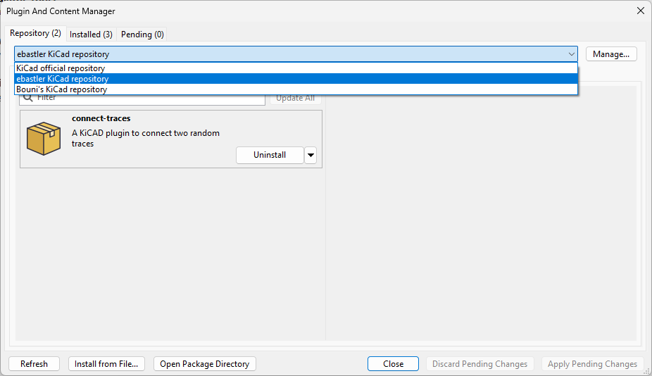

# connect-traces
This is a simple KiCAD plugin, intended at connecting two traces with one another. It works by extending or shortening both until they intersect. It includes error handling, showing errors if an incorrect amount of traces has been selected. 

No collision detection is performed, this has to be done by the user and DRC in a separate step.

## Credit
This plugin has been created by [elpekenin](https://github.com/elpekenin), I (ebastler) am only sharing it through my already set-up KiCAD PCM custom repository.

## How to install
Open the KiCAD "Plugin and Content Manager" (usually referred to as "PCM") and click on "Manage". Add a new entry with the plus sign and paste 

```
https://raw.githubusercontent.com/ebastler/ebastler-KiCAD-repository/main/repository.json
```

From this point on you will have "ebastler KiCAD repository" in your drop-down selection, and it will allow you to install (and update) this plugin through PCM - easy and hassle-free.



### **We do not assume any responsibility for broken PCBs or damages derived from errors in this plugin or through incorrect use. Use at your own risk, and please open an issue or pull-request if you encounter any errors.**